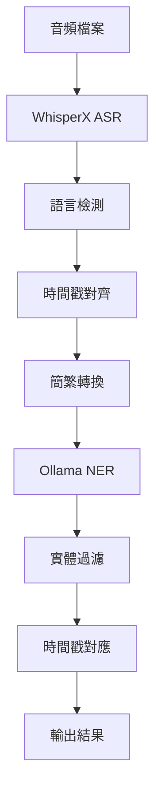

# Task 1 - 語音識別與命名實體識別 (ASR + NER)

## 📋 任務概述

Task 1 是 AI Cup 2025 的語音識別任務，主要目標是：
1. **語音轉文字 (ASR)**: 將醫療語音檔案轉換為文字
2. **命名實體識別 (NER)**: 從轉錄文字中識別並標註醫療相關實體
3. **時間戳對齊**: 為識別出的實體提供精確的時間戳資訊

## 🚀 主要功能

### 1. 語音識別 (ASR)
- 使用 **WhisperX Large-v3** 模型進行高精度語音識別
- 支援中文語音處理，包含簡繁體轉換
- 提供字級別 (character-level) 的時間戳對齊
- 多語言檢測與處理

### 2. 命名實體識別 (NER)
- 使用 **Ollama Qwen3:8b** 模型進行醫療 NER
- 支援 20 種醫療相關實體類別：
  - **人物**: PATIENT, DOCTOR, FAMILYNAME, PERSONALNAME
  - **職業**: PROFESSION
  - **地點**: ROOM, DEPARTMENT, HOSPITAL, STREET, CITY, DISTRICT, COUNTY, STATE, COUNTRY
  - **時間**: AGE, DATE, TIME, DURATION, SET
  - **其他**: PHONE

### 3. 時間戳對齊
- 基於字符級別的精確時間戳計算
- 實體在語音中的起始和結束時間
- 支援重複實體的多次出現標註

## 📁 檔案結構

```
task1/
├── README.md                    # 本說明文件
├── ollama_qwen_whis.py          # 主要處理腳本 (WhisperX + Ollama)
└── Whisperx.ipynb              # WhisperX 進階版本
```

## 🔧 環境設置

### 必要套件
```bash
pip install whisperx
pip install ollama
pip install opencc-python-reimplemented
pip install torch
pip install transformers
pip install tqdm
pip install numpy
```

### 模型安裝
```bash
# 安裝 Ollama
ollama pull qwen3:8b

# WhisperX 模型會自動下載
```

## 💻 使用方法

### 1. 基本使用 - ollama_qwen_whis.py

```bash
python ollama_qwen_whis.py --input_dir "path/to/audio" --task1_output "output.txt"
```

#### 參數說明：
- `--input_dir`: 輸入音頻檔案目錄
- `--task1_output`: Task 1 輸出檔案路徑 (ASR 結果)
- `--model`: WhisperX 模型名稱 (預設: large-v3)
- `--device`: 運算裝置 (預設: cuda)
- `--language`: 指定辨識語言 (預設: 自動檢測)

#### 輸出格式：
**Task 1 (ASR)**: `檔案名稱\t轉錄文字`
```
001	病人王小明今天下午三點要做手術
002	醫師說明天早上八點要回診
```

**Task 2 (NER)**: `檔案名稱\t實體類別\t開始時間\t結束時間\t實體文字`
```
001	PATIENT	2.50	3.20	王小明
001	TIME	5.10	6.30	下午三點
```

### 2. Jupyter Notebook 版本

#### Whisperx.ipynb
- 完整的 WhisperX 處理流程
- 字符級別時間戳對齊
- 適合逐步分析和除錯

## ⚙️ 技術特點

### WhisperX 優勢
- **高精度**: Large-v3 模型提供業界領先的 ASR 性能
- **字符對齊**: 精確到字符級別的時間戳
- **多語言**: 自動語言檢測與處理
- **GPU 加速**: 支援 CUDA 加速運算

### Ollama NER 優勢
- **醫療專用**: 針對醫療場景優化的 prompt 設計
- **中文支援**: 原生支援繁體中文處理
- **規則過濾**: 內建醫療實體過濾規則
- **本地部署**: 無需外部 API，保護資料隱私

## 📊 處理流程



## 🎯 NER 標註規則

### 關鍵規則
- **PATIENT/DOCTOR 優先**: 醫療場景中人物預設為病人，除非明確標示為醫師
- **代稱排除**: "爸爸"、"媽媽"、"哥哥" 等代稱不算 NAME 範疇
- **醫師標識**: 名字後加 "醫師"、"醫生"、"總" 等職稱標示為 DOCTOR
- **地點精確**: HOSPITAL 必須是具體醫院名稱，"醫院"、"本院" 不算
- **時間具體**: TIME 需要明確時間點，如 "下午6點"、"兩點半"

### 過濾詞彙
- **代詞**: 我、你、他、她等
- **親屬稱謂**: 爸爸、媽媽、哥哥等  
- **模糊地點**: 醫院、本院、手術室等
- **模糊時間**: 等一下、剛剛、現在等

## 🔍 除錯與優化

### 常見問題
1. **CUDA 記憶體不足**: 降低 batch_size 或使用 CPU
2. **Ollama 連線失敗**: 確認 Ollama 服務正在運行
3. **音頻格式錯誤**: 確保音頻為 .wav 格式

### 性能優化
- 使用 GPU 加速 (CUDA)
- 批次處理多個檔案
- 預載入模型避免重複載入

## 📈 評估指標

- **ASR 準確度**: 字符錯誤率 (CER)
- **NER F1 分數**: 實體識別的精確率和召回率  
- **時間戳精度**: 實體時間邊界的準確性

## 🔗 相關連結

- [WhisperX GitHub](https://github.com/m-bain/whisperX)
- [Ollama 官網](https://ollama.ai/)
- [OpenCC 繁簡轉換](https://github.com/BYVoid/OpenCC)

## 📝 更新日誌

- **v1.0**: 基礎 WhisperX + Ollama 整合
- **v1.1**: 優化 NER 過濾規則
- **v1.2**: 改進時間戳對齊算法
